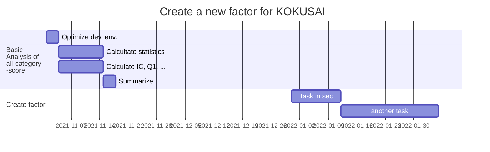

# Strategy to create new factor

## Schedule
```flow
st=>start:>http://www.google.com[blank]
e=>end:>http://www.google.com
op1=>operation: Basic analysis of all-catecory-score for each TruValue type
op2=>operation: Identify the kye points for alpha.
para=>parallel: Select the importance to key

st(right)->op1
op1->op2
op2->para(path1, top)
```



## What is important?