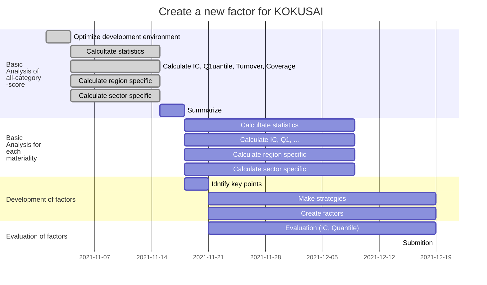

# 外株用TruValueファクター開発

[](https://open.vscode.dev/Naereen/badges) 
&ast; README.mdを快適に読むために，Visual Studio Codeに以下の拡張機能を追加することを推奨．
[](https://marketplace.visualstudio.com/items?itemName=yzhang.markdown-all-in-one) &emsp; [](https://marketplace.visualstudio.com/items?itemName=shd101wyy.markdown-preview-enhanced)
&ast;&ast;または[Typola](https://typora.io/)上でも快適に閲覧可能．

---
## About
[TruValueデータ](https://insight.factset.com/resources/at-a-glance-truvalue-labs-insight360-datafeed)を用いて[KOKUSAI](https://www.msci.com/search?keywords=KOKUSAI)に有効な新ファクターを開発する．

### What is TruValue?
TruValueスコアは企業のESG行動を評価したスコアであり，4つのタイプに分類される．
- Pulse: 企業の短期的なESGパフォーマンスを測定
    $$
    {Pulse}_t = 
    $$
- Insight: 企業の長期的なESGパフォーマンスを測定
    $$
    {Insight}_t = {Insight}_t
    $$
- Momentum: 12か月に渡る企業のESGパフォーマンスのトレンド
    $$
    {Momentum}_t = 
    $$
- Volume: 過去12か月間の企業のESGの記事数

[](https://insight.factset.com/resources/at-a-glance-truvalue-labs-insight360-datafeed)

### Materiality

TruValueのmaterialityは[SASB's Materiality Map <sup>®</sup>](https://materiality.sasb.org/materiality.html)に準拠している．

- Environment	
    - GHG Emissions (GHG排出量)
    - Air Quality (大気質)
    - Energy Management (エネルギー管理)
    - Water & Wastewater Management (水及び排水管理)
    - Waste & Hazardous Materials Management (廃棄物及び有害物質管理)
    - Ecological Impacts (生体多様性影響)
- Social Capital
    - Human bottoms & Community Relations (人権及び地域社会との関係)
    - Customer Privacy (お客様のプライバシー)
    - Data Security (データセキュリティ)
    - Access & Affordability (アクセスおよび手頃な価格)
    - Product Quality & Safety (製品品質・製品安全)
    - Customer Welfare (消費者の福利)
    - Selling Practices & Product Labeling (販売慣行・製品表示)
- Human Capital
    - Labor Practices (労働慣行)
    - Employee Health & Safety (従業員の安全性)
    - Employee Engagement, Diversity & Inclusion (従業員参画・ダイバーシティと包摂性)
- Business Model & Innovation
    - Product Design & Lifecycle Management (製品及びサービスのライフサイクルへの影響)
    - Business Model Resilience (ビジネスモデルの強靭性)
    - Supply Chain Management (サプライチェーンマネジメント)
    - Materials Sourcing & Efficiency (材料調達及び資源効率性)
    - Physical Impacts of Climate Change (気候変動の物理的影響)
- Leadership & Governance
    - Business Ethics (事業倫理)
    - Competitive Behavior (競争的行為)
    - Management of the Legal & Regulatory Environment (規制の把握と政治的影響)
    - Critical Incident Risk Management (重大インシデントリスク管理)
    - Systemic Risk Management (システミックリスク管理)

### Where is the dataset is stored?

- 格納ディレクトリ: ```./input/tv_score_for_kokusai```
- データ更新方法: 以下のコマンドを叩く
    ```bash
    python ./src/load.py
    ```

---
## Plan

### Flow
開発フローは以下のように考えている．

```flow
st=>start
e=>end: Submit
op1=>operation: Analyze all-catecory-score
op2=>operation: Identify the kye points
op3=>operation: Make a strategy
op4=>operation: Create a factor
op5=>operation: Evaluate a factor
cond=>condition: Is the factor effective?

st(bottom)->op1(bottom)->op2(bottom)->op3(bottom)->op4(bottom)->op5(bottom)->cond
cond(yes)->e
cond(no)->op3
```

### Schedule

開発日程は以下のように考えている．



---
## Notation

Symbols|Meaning
-|-|
$[0, T]$ | データ取得期間
$Comp(t)$ | 時刻$t$における企業の集合
$Sec(t)$ | 時刻$t$におけるセクターの集合
$s(t, \cdot): Comp(t) \ni c \mapsto s(t, c) \in Sec(t)$ | 時刻$t$における企業$c \in Comp(t)$が属するセクター
$Reg(t)$ | 時刻$t$における地域の集合
$r(t, \cdot): Comp(t) \ni c \mapsto r(t, c) \in Reg(t)$ | 時刻$t$における企業$c \in Comp(t)$が属する地域
${Pulse} (t, c)$ | 時刻$t$における企業$c \in Comp(t)$のPulseスコア
${Insight} (t, c)$ | 時刻$t$における企業$c \in Comp(t)$のInsightスコア 
${Momentum} (t, c)$ | 時刻$t$における企業$c \in Comp(t)$のMomentumスコア
${Volume} (t, c)$ | 時刻$t$における企業$c \in Comp(t)$のVolumeスコア

---
## What is important to create factors?
