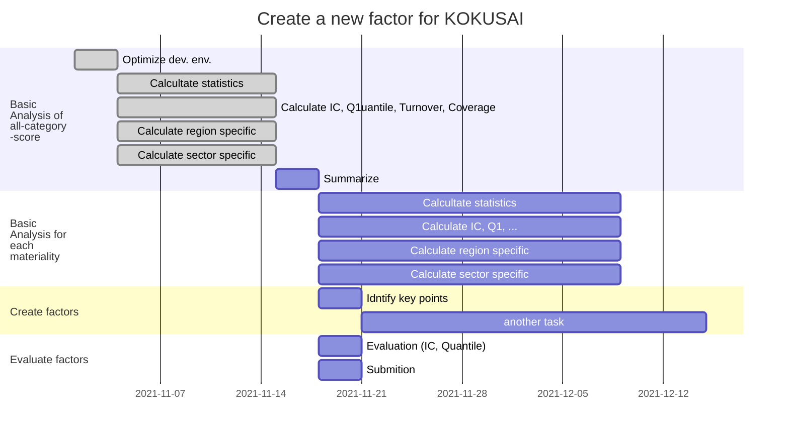

# 外株用TruValueファクター開発

## About
[TruValueデータ](https://insight.factset.com/resources/at-a-glance-truvalue-labs-insight360-datafeed)を用いて[KOKUSAI](https://www.msci.com/search?keywords=KOKUSAI)に有効な新ファクターを開発する．

### What is TruValue?
TruValueスコアは企業のESG行動を評価したスコアであり，4つのタイプに分類される．
- Pulse
    ```math
    {Pulse}_t = 
    ```
- Insight
- Momentum
- Volume


## Plan
### Flow
```flow
st=>start:>http://www.google.com[blank]
e=>end:>http://www.google.com
op1=>operation: Basic analysis of all-catecory-score for each TruValue type
op2=>operation: Identify the kye points for alpha.
para=>parallel: Select the importance to key

st(right)->op1
op1->op2
op2->para(path1, top)
```

### Schedule


## What is important?
